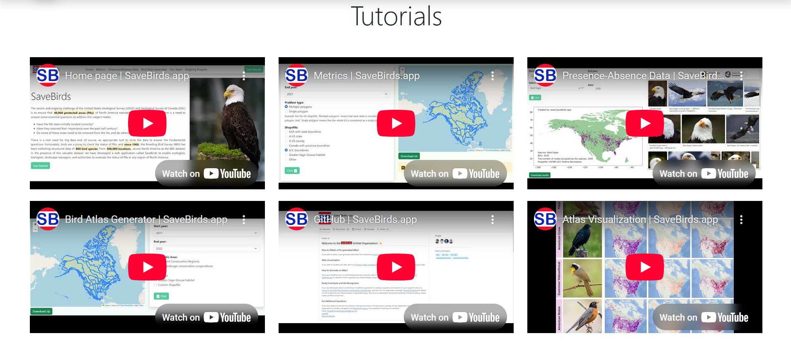

The Prompt for developing the frontend of savebirds.app

**Table of contents**

  <a href="#0-roadmap"><i><b>0. Roadmap</b></i></a>

  
<a href="#1-header-navigation-bar"><i><b>1. Header (Navigation Bar)</b></i></a>

  

              <a href="#11-left-section">1.1. Left Section</a> 
              <a href="#12-center-section">1.2. Center Section</a> 
              <a href="#13-right-section">1.3. Right Section</a> 
  

  
<a href="#2-home"><i><b>2. Home</b></i></a>

  

              <a href="#21-explanation">2.1. Explanation</a> 
              <a href="#22-bird-image">2.2. Bird Image</a> 
  

  
<a href="#3-metrics"><i><b>3. Metrics</b></i></a>

  

              <a href="#31-explanation-text">3.1. Explanation Text</a> 
              <a href="#32-form-inputs">3.2. Form Inputs</a> 
              <a href="#33-map-viewer">3.3. Map Viewer</a> 
  

  
<a href="#4-presence-absence-data"><i><b>4. Presence-Absence Data</b></i></a>

  

              <a href="#41-explanation-text">4.1. Explanation Text</a> 
              <a href="#42-form-inputs-bird-selection-and-data-query-panel">4.2. Form Inputs (Bird Selection and Data Query Panel)</a> 
              <a href="#421-species-list-for-dropdown">4.2.1. Species List (for Dropdown)</a> 
              <a href="#43-map-section">4.3. Map Section</a> 
              <a href="#431-result">4.3.1. Result</a> 
              <a href="#44-bird-image-recovery-panel">4.4. Bird Image Recovery Panel</a> 
  

  
<a href="#5-bird-atlas-generator-bag"><i><b>5. Bird Atlas Generator (BAG)</b></i></a>

  

              <a href="#51-explanation-text">5.1. Explanation Text</a> 
              <a href="#52-form-inputs">5.2. Form Inputs</a> 
              <a href="#53-map-viewer">5.3. Map Viewer</a> 
  

  
<a href="#6-our-team"><i><b>6. Our Team</b></i></a>

  

              <a href="#61-team-overview">6.1. Team Overview</a> 
              <a href="#62-team-members-profiles">6.2. Team Members Profiles</a> 
              <a href="#621-team-member-card-component">6.2.1. Team Member Card Component</a> 
              <a href="#622-team-members-data">6.2.2. Team Members Data</a> 
              <a href="#63-implementation-notes">6.3. Implementation Notes</a> 
  

  
<a href="#7-ongoing-projects"><i><b>7. Ongoing Projects</b></i></a>

  

              <a href="#71-page-overview">7.1. Page Overview</a> 
              <a href="#72-project-cards">7.2. Project Cards</a> 
                        <a href="#721-project-listings">7.2.1. Project Listings</a> 
                        <a href="#722-team-member-display">7.2.2. Team Member Display</a> 
                        <a href="#723-additional-team-members">7.2.3. Additional Team Members</a> 
                        <a href="#724-image-resources-and-implementation">7.2.4. Image Resources and Implementation</a> 
  

  
<a href="#8-github-repository"><i><b>8. GitHub Repository</b></i></a>

  

              <a href="#81-github-repository-page">8.1. GitHub Repository Page</a> 
                        <a href="#811-github-links-implementation">8.1.1. GitHub Links Implementation</a> 
                        <a href="#812-contact-information">8.1.2. Contact Information</a> 
  

  
<a href="#9-tutorials"><i><b>9. Tutorials</b></i></a>

  

              <a href="#91-tutorial-videos-layout">9.1. Tutorial Videos Layout</a> 
              <a href="#92-video-links-implementation">9.2. Video Links Implementation</a> 
              <a href="#93-implementation-notes">9.3. Implementation Notes</a> 
  

  
<a href="#10-footer"><i><b>10. Footer</b></i></a>

  

              <a href="#101-footer-structure">10.1. Footer Structure</a> 
              <a href="#102-reference-links-implementation">10.2. Reference Links Implementation</a> 
              <a href="#1021-resource-links">10.2.1. Resource Links</a> 
              <a href="#1022-implementation-notes">10.2.2. Implementation Notes</a> 
  

# 0. Roadmap

🔧 **Task:**
Complete and accurate redesign of savebirds.app as a Vue 3 project using Bootstrap and BS-Icons, without any backend dependencies.

🔍 **Scope:**
• All visible content of the site (images, texts, links, menu order, scrolling, element positioning, fonts, etc.)
• One-page structure with six clickable menus
• All links must be properly clickable and internally connected (Anchors)
• All sections must be created separately and readable in reusable components
• Fully responsive for desktop only
• No dependency on API or server (content must be static)

⚙️ **Tech stack:**
• Vue 3
• Bootstrap 5
• Bootstrap Icons

📦 **Output:**
• Complete project structure in an organized folder system that is not overly complex
• (components, views, assets, router, etc.)
• All *.vue files completely clean and understandable
• Complete setup of App.vue and router/index.js
• Ready for delivery to the backend team without any questions or ambiguities

🔇 **Important:**
Don't ask any questions. Extract whatever is necessary from the original site (https://savebirds.app) and implement it.
Assume you are the original designer and you are going to deliver this project to a company.
Although I have also left for you the photo of all pages.

# 1. Header (Navigation Bar)

## 1.1. Left Section

- Logo Image:
  
- Site Name (Text right to logo): SaveBirds

## 1.2. Center Section

- Menu Items (to be displayed horizontally):
  - Home
  - Metrics
  - Presence-Absence Data
  - Bird Atlas Generator
  - Our Team
  - Ongoing Projects

## 1.3. Right Section

- Button Text: Get Started
- Button Color: Green
- When we click on the green Get Started icon, the program will go to the metrics page.

# 2. Home

.png)

## 2.1. Explanation

- Title: Savebirds
- Text Content:
- Button Text: Get Started
- Button Color: Green
- When we click on the green Get Started icon, the program will go to the metrics page.

## 2.2. Bird Image

- Bald Eagle standing on wood
- Style: Rounded corners + Shadow + Full width (responsive)
  

# 3. Metrics

## 3.1. Explanation Text

- Title: Metrics
- Text Content:

## 3.2. Form Inputs

- Start year: dropdown with range 1966 to latest year (1966 to ...)
- End year: Dropdown synced with Start year
- Problem type: Radio buttons (Multiple polygons / Single polygon)
- Geographic Area: Radio buttons (BCR, LCC, USA, Canada, Greater Sage-Grouse habitat, Custom Shapefile)
- Button Text: Click
- Button Green Icon: click

## 3.3. Map Viewer

- Interactive Map: OpenStreetMap (via Leaflet.js)
- Zoom Controls: موجود (Zoom In / Zoom Out)
- Map Area: Full width map view
- Yellow Button with Text: Click to get results!
- Button Icon: arrow-left
- Map Source Text: "Leaflet | Data by OpenStreetMap, under ODbL"

# 4. Presence-Absence Data

This page allows users to select a bird species and view presence-absence data across North America. It consists of two primary components:

## 4.1. Explanation Text

- Title: Presence-Absence Data
- Text Content:

## 4.2. Form Inputs (Bird Selection and Data Query Panel)

- Start year: dropdown with range 1966 to latest year (1966 to ...)
- End year: Dropdown synced with Start year
- Species name: searchable dropdown (Bald Eagle)
- AOU: Auto-generated (3520)

### 4.2.1. Species List (for Dropdown)

- Bald Eagle
- Snowy Owl
- American Robin
- Black-capped Chickadee
- Northern Cardinal
- ... ( )
- searchable dropdown (populated from a list of 800+ birds)
- Aou: – automatically filled once the species is selected
- Button Text: Click
- Button Color: Green

## 4.3. Map Section

- Map with species presence points
- Button Text: Download results
- Button Color: Green
- `Click` button – triggers map and data generation

### 4.3.1. Result:

- A static map with routes where the selected species has been observed
- Metadata such as:
  - AOU code
  - Year interval
  - Number of occupied routes
  - Source shapefile info

## 4.4. Bird Image Recovery Panel

- Dynamically display real-world images of the selected bird species using the Bing image search engine

# 5. Bird Atlas Generator (BAG)

.png)

## 5.1. Explanation Text

- Title: Bird Atlas Generator
- Text Content:
  -1.png)

## 5.2. Form Inputs

- Start year: dropdown with range 1966 to latest year (1966 to ...)
- End year: Dropdown synced with Start year
- Geographic Area: Radio buttons (BCR, LCC, USA, Canada, Greater Sage-Grouse habitat, Custom Shapefile)
- Button Text: Click
- Button Green Icon: click
  -2.png)

## 5.3. Map Viewer

- Interactive Map: OpenStreetMap (via Leaflet.js)
- Zoom Controls: (Zoom In / Zoom Out)
- Map Area: Full width map view
- Yellow Button with Text: Click to get results!
- Button Icon: arrow-left
- Map Source Text: "Leaflet | Data by OpenStreetMap, under ODbL"
  -3.png)

# 6. Our Team

## 6.1. Team Overview

- Title: "Our Team" (centered, large font)
- Layout: Grid of team member profile cards (responsive - 4 cards on large screens, 2 on medium, 1 on mobile)
- Styling: Clean, professional design with consistent spacing and alignment

## 6.2. Team Members Profiles

### 6.2.1. Team Member Card Component

Each team member should be displayed in a card with the following elements:

- Circular profile image (180px diameter with subtle border and shadow)
- Full name (bold, larger font)
- Title/Position
- Department/Program
- Organization/University
- Social/Professional links as clickable icons:
  - Website (globe icon)
  - Email (envelope icon)
  - LinkedIn (LinkedIn logo)
  - Google Scholar (scholar icon)

### 6.2.2. Team Members Data

#### 6.2.2.1. Mostafa M. Rezaee

- **Position:** Ph.D. Candidate
- **Department:** Data Science Program
- **Organization:** Bowling Green State University
- **Links:**
  - Website: https://mostafa-mr.com/
  - Email: rezaeem@bgsu.edu
  - LinkedIn: https://www.linkedin.com/in/mostafa-m-rezaee/
  - Google Scholar: https://scholar.google.com/citations?user=jvcCIJYAAAAJ&hl=en

#### 6.2.2.2. Robert C. Green II

- **Position:** Associate Professor
- **Department:** Computer & Data Science
- **Organization:** Bowling Green State University
- **Links:**
  - Website: https://rgreen13.gitlab.io/
  - LinkedIn: https://www.linkedin.com/in/rob-green-6371772/
  - Google Scholar: https://scholar.google.com/citations?hl=en&user=jNzxwwEAAAAJ

#### 6.2.2.3. Andrew Gregory

- **Position:** Assistant Professor
- **Department:** Conservation Biology and Landscape Ecology
- **Organization:** University of North Texas
- **Links:**
  - Website: https://biology.unt.edu/people/andrew-gregory
  - LinkedIn: https://www.linkedin.com/in/andrew-gregory-b1aa51159/
  - Google Scholar: https://scholar.google.com/citations?hl=en&user=I7rG0ksAAAAJ

#### 6.2.2.4. Hamid Shojaei

- **Position:** Senior Data Science Advisor
- **Organization:** Excelacom Inc.
- **Links:**
  - LinkedIn: https://www.linkedin.com/in/hamid-shojaei/
  - Google Scholar: https://scholar.google.com/citations?hl=en&user=RY50kBoAAAAJ

## 6.3. Implementation Notes

- Use a component-based approach for team member cards to ensure consistency
- All social links should be functional and open in a new tab
- Icons should have hover effects for a better user experience
- Profile images should be optimized for the web (compressed while maintaining quality)
- Implement responsive design to ensure proper display on all devices

# 7. Ongoing Projects

## 7.1. Page Overview

- Title: "Ongoing Projects" (centered, large font)
- Subtitle: "Showcase your project, if you use SaveBirds or cite it, simply by sending me (Mostafa M. Rezaee) your project title and team members' information."

## 7.2. Project Cards

- Each project displayed in a green card with document icon
- Numbered project titles (1-7)
- "Link" text where applicable (clickable - opens the project's website or resource in a new tab)
- Project team members displayed in a grid below each project

### 7.2.1. Project Listings

1. SaveBirds.app: A web tool for analyzing the North American Breeding Bird Survey data to enhance conservation in protected areas (Link: clickable)
2. Introducing Bird Atlas Generator by SaveBirds.app: A Novel Tool for Creating Atlases Using BBS Data in North America
3. Mapping Avian Hotspots: Discovering Geographic Concentrations of North American Birds with SaveBirds.app's Data-Driven Insights
4. Assessing the Impact of Drought and Land-use Change on Northern Bobwhite Population Stability Using Emerging Hotspot Analysis and Multiscale Geographically Weighted Regression
5. Greater Sage-Grouse are an umbrella species for shrub-steppe bird communities at range-wide scale
6. Despite Concerns, PVA of American Kestrels at national scale reveals no significant population declines over the last 20 years
7. Kentucky project

### 7.2.2. Team Member Display

- Below each project: grid of team member cards
- Each team member card includes:
  - Circular profile photo
  - Full name
  - Position/Title
  - Department/Program
  - Organization/University
  - Social media icons (website, email, LinkedIn, Google Scholar)

### 7.2.3. Additional Team Members

- Masoud Javadpoor

  - Research assistant
  - Geospatial Data Scientist and Urban Planning
  - Shiraz University
  - Links:
    - Website: https://masoud-javadpoor.com/
    - LinkedIn: https://www.linkedin.com/in/masoud-javadpoor/
    - Google Scholar: https://scholar.google.com/citations?hl=en&user=NHT9I8sAAAAJ
- Fábio Albuquerque

  - Associate Professor
  - College of Integrative Sciences and Arts
  - Arizona State University
  - Links:
    - LinkedIn: https://www.linkedin.com/in/fabio-albuquerque-299067123/
    - Google Scholar: https://scholar.google.com/citations?hl=en&user=Fa7tJHgAAAAJ
- Ben Hendrickson

  - PhD Student
  - Biology
  - University of North Texas
  - Links: No public profiles available
- Amanda Long

  - MSc Student
  - Biology
  - University of North Texas
  - Links:
    - LinkedIn: https://www.linkedin.com/in/amanda--long/
- Maddy Kaleta

  - MSc Student
  - Biology
  - University of North Texas
  - Links: No public profiles available
- Rachel Pigg

  - Assistant Professor
  - Department of Biology
  - University of Louisville
  - Links:
    - LinkedIn: https://www.linkedin.com/in/rachel-pigg-461326186/

### 7.2.4. Image Resources and Implementation

- **Profile Images**:

  - **Source**: Use the team member images provided in the `/images` directory as shown in the reference screenshots
  - All team member profile images should be stored in the `/images/team/` directory
  - Naming convention: `firstname-lastname.jpg` (all lowercase, hyphenated)
  - Images should be cropped to square format before applying circular styling
  - Recommended resolution: 300x300 pixels minimum (higher resolution preferred for retina displays)
  - Optimize images for web using tools like ImageOptim or TinyPNG
  - Apply circular styling using CSS: `border-radius: 50%`
  - Add subtle border and shadow for enhanced visual appeal
- **Project Icons**:

  - **Source**: Use the document/file icons shown in the reference screenshots in the `/images` directory
  - Document/file icons used in project cards should be stored in `/images/icons/`
  - Prefer SVG format for scalable, high-quality icons
  - Ensure consistent sizing across all project cards
- **Image Accessibility**:

  - All images must include appropriate alt text for screen readers
  - Team member images should use alt text in format: "Profile photo of [Name]"
  - Icon images should describe their function, not appearance
- **Implementation Note**:

  - The exact images to use are the ones shown in the reference screenshots provided in the `/images` directory (images/6-Ongoing-Projects-1.png through images/6-Ongoing-Projects-7.png)
  - Extract the circular profile images of team members from these screenshots if individual images are not available separately

# 8. GitHub Repository

## 8.1. GitHub Repository Page

- Title: "Github" (centered, large font)
- SaveBirds.app repository information and description
- GitHub organization details
- README.md content displayed with project information

### 8.1.1. GitHub Links Implementation

- **All blue links/text on the page**: When clicked, should navigate to https://github.com/SaveBirds-app
- This includes:
  - Blue text in tutorial links
  - Blue text in organization links
  - Blue text in references to the Bird Atlas Generator
  - Repository URL link under the SaveBirds.app logo
- **Follow button**: Functional button that allows users to follow the repository
- **People section**: Shows profile images of organization members
- **Tags/Topics**: Clickable topic tags related to the project

### 8.1.2. Contact Information

- Email: mostafa.mohammadrezaee@gmail.com
- LinkedIn link for Mostafa M. Rezaee
- Personal Website link for additional contact options
- Organization manager contact details prominently displayed

# 9. Tutorials

## 9.1. Tutorial Videos Layout

- Title: "Tutorials" (centered, large font)
- Grid layout of YouTube tutorial videos (2 rows × 3 columns)
- Each video displayed as a YouTube embed with thumbnail and play button

## 9.2. Video Links Implementation

- All YouTube videos should be properly embedded and clickable
- When clicked, videos should open in YouTube or play directly on the page
- Video links and their corresponding content:

| Video Position | Title                                 | YouTube URL                  |
| -------------- | ------------------------------------- | ---------------------------- |
| Top Left       | Home page\| SaveBirds.app             | https://youtu.be/IFbb-o4_POg |
| Top Center     | Metrics\| SaveBirds.app               | https://youtu.be/hHcHOo5oYXc |
| Top Right      | Presence-Absence Data\| SaveBirds.app | https://youtu.be/tn3nFSa2GEU |
| Bottom Left    | Bird Atlas Generator\| SaveBirds.app  | https://youtu.be/huDsVljsZIc |
| Bottom Center  | GitHub\| SaveBirds.app                | https://youtu.be/fKw_LcyKndM |
| Bottom Right   | Atlas Visualization\| SaveBirds.app   | https://youtu.be/iC3IGFMPpxU |

- Table at the bottom of the page listing all video links for reference

## 9.3. Implementation Notes

- Use YouTube's embed API for optimal performance
- Include proper video titles and descriptions
- Enable video controls (play/pause, volume, fullscreen)
- Make videos responsive for different screen sizes
- Ensure accessibility features are enabled (captions, keyboard navigation)

# 10. Footer

## 10.1. Footer Structure

- Simple, clean footer design with dark background
- Contains reference links to data sources and related resources

## 10.2. Reference Links Implementation

- All blue text links should be functional and clickable
- When clicked, each link should open in a new tab

### 10.2.1. Resource Links

| Resource Title                            | Link URL                                                          |
| ----------------------------------------- | ----------------------------------------------------------------- |
| North American Breeding Bird Survey       | https://www.pwrc.usgs.gov/bbs/index.cfm                           |
| BBS dataset (Online Retrieval System)     | https://www.pwrc.usgs.gov/BBS/RawData/                            |
| BBS dataset (Raw data & related articles) | https://www.sciencebase.gov/catalog/item/52b1dfa8e4b0d9b325230cd9 |
| LCC (Landscape conservation cooperatives) | https://www.sciencebase.gov/catalog/item/4fbbd87be4b0ee66f48f66f3 |
| BCR (Bird Conservation Regions)           | https://nabci-us.org/resources/bird-conservation-regions-map/     |

### 10.2.2. Implementation Notes

- Each link should have proper hover effect to indicate clickability
- Ensure all links have appropriate aria-labels for accessibility
- Include proper title attributes for tooltips on hover
- Track outbound link clicks for analytics if needed
- Test all links for proper functionality before deployment
