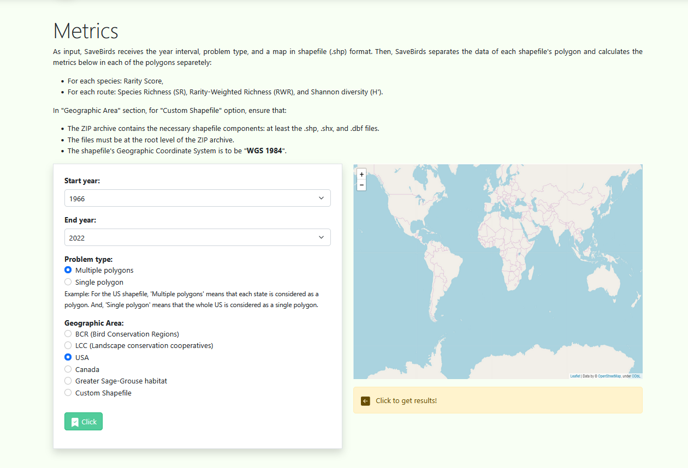

<h1 align="center">SaveBirds.app Metrics Page</h1>

# 1. Overview
Create the Metrics page for SaveBirds.app using Vue 3 and Bootstrap 5. This page allows users to select parameters for analyzing bird survey data and visualize the results on an interactive map.

# 2. Design Requirements

## 2.1. Layout Structure
The Metrics page should consist of three main sections:
- **Explanation Section**: Title and descriptive text
- **Form Inputs Section**: User selection controls for data parameters
- **Map Viewer Section**: Interactive map display with controls

## 2.2. Visual Reference

# 3. Component Specifications

## 3.1. Explanation Section
- **Title**:
  - Text: "Metrics"
  - Font: Large, bold, prominent
  - Position: Top of the content area

- **Descriptive Text**:
  - Content: Clear explanation of the Metrics feature and how to use it
  - Length: 1-2 paragraphs explaining:
    - Purpose of the Metrics tool
    - How to use the form controls to generate results
    - What the generated map will show
  - Font: Clean, readable font consistent with the rest of the site
  - Position: Below the title

## 3.2. Form Inputs Section
- **Containing Element**:
  - Style: Card or panel with light background
  - Border: Subtle rounded border or shadow
  - Padding: Sufficient spacing around form elements

- **Form Controls**:
  - **Start Year Dropdown**:
    - Label: "Start year"
    - Options: Range from 1966 to current year
    - Default: 1966
    - Requirement: Must be implemented as a dropdown select control
  
  - **End Year Dropdown**:
    - Label: "End year"
    - Options: Synchronized with Start year (equal to or greater than selected start year)
    - Default: Current year
    - Requirement: Must be implemented as a dropdown select control
  
  - **Problem Type Radio Buttons**:
    - Label: "Problem type"
    - Options: "Multiple polygons" / "Single polygon"
    - Layout: Horizontal or vertical radio button group
    - Default: "Multiple polygons"
  
  - **Geographic Area Radio Buttons**:
    - Label: "Geographic Area"
    - Options: "BCR", "LCC", "USA", "Canada", "Greater Sage-Grouse habitat", "Custom Shapefile"
    - Layout: Radio button group arranged in a clean layout
    - Default: "BCR"
  
  - **Submit Button**:
    - Text: "Click"
    - Icon: Green check icon or arrow
    - Color: Green (#28a745 or Bootstrap's .btn-success)
    - Position: Below the form controls
    - Action: Trigger map data loading and visualization

## 3.3. Map Viewer Section
- **Map Container**:
  - Size: Full width of the content area
  - Height: Appropriate height for good visibility (minimum 400px)
  - Border: Subtle border or shadow
  
- **Map Implementation**:
  - Library: Leaflet.js
  - Base Map: OpenStreetMap
  - Features:
    - Zoom controls (+ and - buttons)
    - Draggable/pannable map area
    - Responsive to different screen sizes
  
- **Action Button**:
  - Text: "Click to get results!"
  - Color: Yellow or amber
  - Icon: Left-pointing arrow (arrow-left)
  - Position: Prominently placed on or near the map
  - Action: Trigger the display of detailed analysis results
  
- **Attribution**:
  - Text: "Leaflet | Data by OpenStreetMap, under ODbL"
  - Style: Small, subtle but readable
  - Position: Bottom of the map (typically right corner)

# 4. Responsive Behavior
- **Desktop View**:
  - Two-column layout may be used for explanation and form inputs
  - Map spans full width below the form section
  - All controls easily accessible without scrolling

- **Mobile View**:
  - Single-column layout with sections stacked vertically
  - Form inputs may use accordion or collapsible sections if needed
  - Map sized appropriately for mobile viewing
  - All interactive elements sized appropriately for touch input

# 5. Implementation Notes
- Create as a Vue component in `views/MetricsView.vue`
- Implement form controls using Vue's v-model for data binding
- Use Leaflet.js library for the interactive map (vue-leaflet can be considered)
- Ensure proper validation of form inputs before submission
- Implement loading indicators for map data retrieval
- Create reusable components for form sections that might be used in other parts of the application

# 6. Data Handling
- Implement client-side validation for all form inputs
- Handle the synchronization between start and end year dropdowns
- Structure the component to emit events or call store actions on form submission
- Since this is a frontend-only implementation, mock the data visualization with static map examples

# 7. Code Structure
- Use semantic HTML5 elements (`<section>`, `<form>`, etc.)
- Implement as a single-file component with template, script, and style sections
- Style using Bootstrap classes with minimal custom CSS
- Create smaller sub-components for complex form sections if needed
- Include appropriate comments for complex logic
- For any custom styles, use scoped CSS to avoid conflicts
