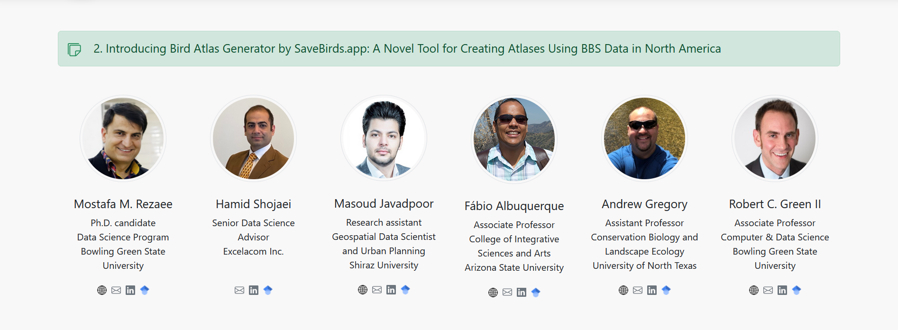
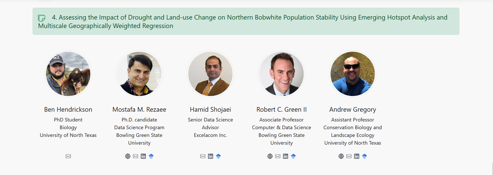
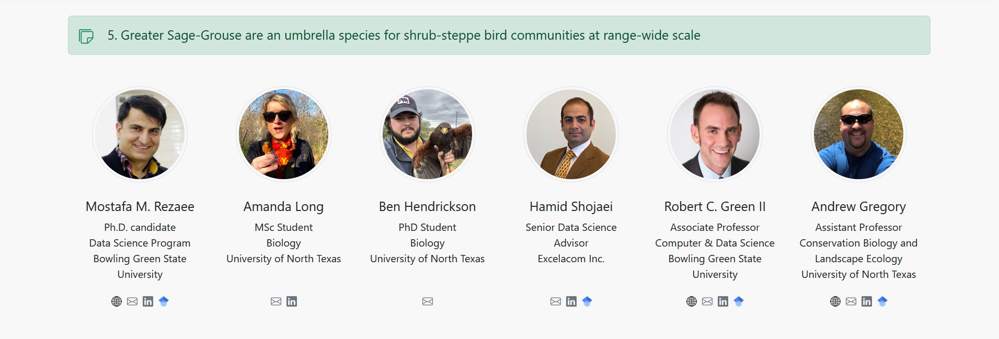

<h1 align="center">SaveBirds.app Ongoing Projects Page</h1>

# 1. Overview
Create the Ongoing Projects page for SaveBirds.app using Vue 3 and Bootstrap 5. This page showcases various research projects that utilize the SaveBirds application, along with the team members involved in each project.

# 2. Design Requirements

## 2.1. Layout Structure
The Ongoing Projects page should consist of two main sections:
- **Page Overview**: Title and introductory text
- **Project Cards**: A collection of project cards displayed sequentially

## 2.2. Visual Reference







# 3. Component Specifications

## 3.1. Page Overview
- **Title**:
  - Text: "Ongoing Projects"
  - Font: Large, bold, centered (display-4 or similar class)
  - Position: Top of the content area
  - Styling: Clean, professional appearance with appropriate spacing

- **Subtitle/Introduction**:
  - Text: "Showcase your project, if you use SaveBirds or cite it, simply by sending me (Mostafa M. Rezaee) your project title and team members' information."
  - Font: Regular weight, slightly smaller than title
  - Position: Below the title
  - Styling: Centered, with appropriate spacing before project cards

## 3.2. Project Cards

### 3.2.1. Project Card Component
Create a reusable card component for displaying project information with the following elements:

- **Card Container**:
  - Background: Green (#28a745 or similar)
  - Border: Rounded corners
  - Shadow: Subtle shadow effect for depth
  - Padding: Sufficient internal spacing
  - Margin: Appropriate spacing between cards

- **Project Icon**:
  - Icon: Document/file icon
  - Color: White or light color to contrast with green background
  - Position: Left side of the project title
  - Size: Proportional to the title text

- **Project Title**:
  - Format: Numbered (1-7) followed by the project name
  - Font: Bold, white or light color
  - Size: Larger than regular text
  - Position: Top of the card after the icon

- **Link Text** (when applicable):
  - Text: "Link"
  - Style: Clickable text, underlined or otherwise distinguished
  - Behavior: Opens the project's website or resource in a new tab
  - Visibility: Only shown for projects with external links

- **Team Members Section**:
  - Layout: Grid of team member mini-cards below the project description
  - Background: Lighter than the main card for contrast
  - Padding: Appropriate spacing around team member information

### 3.2.2. Project Listings
Include the following projects with their details:

1. **SaveBirds.app: A web tool for analyzing the North American Breeding Bird Survey data to enhance conservation in protected areas**
   - Link: Include clickable link
   - Team Members: Show appropriate team members (see section 3.2.3)

2. **Introducing Bird Atlas Generator by SaveBirds.app: A Novel Tool for Creating Atlases Using BBS Data in North America**
   - Team Members: Show appropriate team members

3. **Mapping Avian Hotspots: Discovering Geographic Concentrations of North American Birds with SaveBirds.app's Data-Driven Insights**
   - Team Members: Show appropriate team members

4. **Assessing the Impact of Drought and Land-use Change on Northern Bobwhite Population Stability Using Emerging Hotspot Analysis and Multiscale Geographically Weighted Regression**
   - Team Members: Show appropriate team members

5. **Greater Sage-Grouse are an umbrella species for shrub-steppe bird communities at range-wide scale**
   - Team Members: Show appropriate team members

6. **Despite Concerns, PVA of American Kestrels at national scale reveals no significant population declines over the last 20 years**
   - Team Members: Show appropriate team members

7. **Kentucky project**
   - Team Members: Show appropriate team members

### 3.2.3. Team Member Mini-Card Component
For each project, display relevant team members with the following elements:

- **Container**:
  - Background: White or light color
  - Border: Subtle rounded corners
  - Shadow: Light shadow effect (optional)
  - Size: Appropriate for displaying essential information compactly

- **Profile Image**:
  - Style: Circular profile image (smaller than on Team page, approximately 80-100px diameter)
  - Border: Subtle border or shadow effect
  - Position: Top of the mini-card

- **Name**:
  - Font: Bold, appropriate size
  - Position: Below the profile image

- **Position/Title**:
  - Font: Regular weight, smaller than name
  - Position: Below the name

- **Department/Program**:
  - Font: Regular weight, smaller than position
  - Position: Below the position/title
  - Visibility: If available

- **Organization/University**:
  - Font: Regular weight, same size as department
  - Position: Below the department/program

- **Social Links**:
  - Display: Small row of icon buttons
  - Icons: Website, Email, LinkedIn, Google Scholar (as applicable)
  - Size: Small, appropriate for mini-card
  - Position: Bottom of the mini-card

### 3.2.4. Additional Team Members Data
Include the following additional team members who appear in project cards:

- **Masoud Javadpoor**
  - **Position:** Research Assistant
  - **Department:** Geospatial Data Scientist and Urban Planning
  - **Organization:** Shiraz University
  - **Links:**
    - Website: https://masoud-javadpoor.com/
    - LinkedIn: https://www.linkedin.com/in/masoud-javadpoor/
    - Google Scholar: https://scholar.google.com/citations?hl=en&user=NHT9I8sAAAAJ

- **Fábio Albuquerque**
  - **Position:** Associate Professor
  - **Department:** College of Integrative Sciences and Arts
  - **Organization:** Arizona State University
  - **Links:**
    - LinkedIn: https://www.linkedin.com/in/fabio-albuquerque-299067123/
    - Google Scholar: https://scholar.google.com/citations?hl=en&user=Fa7tJHgAAAAJ

- **Ben Hendrickson**
  - **Position:** PhD Student
  - **Department:** Biology
  - **Organization:** University of North Texas
  - **Links:** No public profiles available

- **Amanda Long**
  - **Position:** MSc Student
  - **Department:** Biology
  - **Organization:** University of North Texas
  - **Links:**
    - LinkedIn: https://www.linkedin.com/in/amanda--long/

- **Maddy Kaleta**
  - **Position:** MSc Student
  - **Department:** Biology
  - **Organization:** University of North Texas
  - **Links:** No public profiles available

- **Rachel Pigg**
  - **Position:** Assistant Professor
  - **Department:** Department of Biology
  - **Organization:** University of Louisville
  - **Links:**
    - LinkedIn: https://www.linkedin.com/in/rachel-pigg-461326186/

# 4. Image Resources and Implementation

## 4.1. Profile Images
- **Source**: Use team member images from the `/images/team/` directory
- **Naming Convention**: `firstname-lastname.jpg` (all lowercase, hyphenated)
- **Format**: Square images cropped to circular display using CSS
- **Resolution**: 300x300px minimum (higher for retina displays)
- **Optimization**: Compress images for web without significant quality loss
- **Styling**: Apply circular style with CSS `border-radius: 50%`
- **Accessibility**: Include appropriate alt text for all images

## 4.2. Project Icons
- **Source**: Use document/file icons from `/images/icons/` directory
- **Format**: SVG preferred for scalability
- **Consistency**: Maintain consistent sizing across all project cards
- **Contrast**: Ensure good visibility against the green card background

# 5. Responsive Behavior
- **Desktop View**:
  - Full-width project cards
  - Team member mini-cards: 4-5 per row depending on available space
  - Comfortable spacing between elements

- **Medium Screen View**:
  - Full-width project cards
  - Team member mini-cards: 3 per row
  - Adapted spacing for readability

- **Mobile View**:
  - Full-width project cards
  - Team member mini-cards: 1-2 per row
  - Increased vertical spacing for touch-friendly interaction
  - Text size adjusted for readability on smaller screens

# 6. Implementation Notes
- Create as a Vue component in `views/OngoingProjectsView.vue`
- Create reusable components:
  - `components/projects/ProjectCard.vue`
  - `components/projects/TeamMemberMiniCard.vue`
- Use Bootstrap 5 grid system for responsive layout
- Store project and team member data in separate data files or as computed properties
- Implement conditional rendering for links and social media icons
- Use v-for directives to iterate through projects and team members
- Ensure all external links open in new tabs with appropriate security attributes

# 7. Component Data Structure
```javascript
// Projects data structure
const projects = [
  {
    id: 1,
    title: "SaveBirds.app: A web tool for analyzing the North American Breeding Bird Survey data to enhance conservation in protected areas",
    externalLink: "https://example.com/project1", // Replace with actual link
    teamMembers: [1, 2, 3, 4] // IDs referencing teamMembers array
  },
  // Additional projects...
];

// Team members data structure (including those from Our Team page plus additional members)
const teamMembers = [
  {
    id: 1,
    name: "Mostafa M. Rezaee",
    position: "Ph.D. Candidate",
    department: "Data Science Program",
    organization: "Bowling Green State University",
    image: "images/team/mostafa-rezaee.jpg",
    links: {
      website: "https://mostafa-mr.com/",
      email: "rezaeem@bgsu.edu",
      linkedin: "https://www.linkedin.com/in/mostafa-m-rezaee/",
      googleScholar: "https://scholar.google.com/citations?user=jvcCIJYAAAAJ&hl=en"
    }
  },
  // Additional team members...
];
```

# 8. Code Structure
- Use semantic HTML5 elements (`<section>`, `<article>`, etc.)
- Implement as single-file components with template, script, and style sections
- Style using Bootstrap classes with minimal custom CSS
- For any custom styles, use scoped CSS to avoid conflicts
- Implement appropriate conditional rendering for optional elements
- Use computed properties to filter team members for each project
- Include appropriate comments for complex logic
